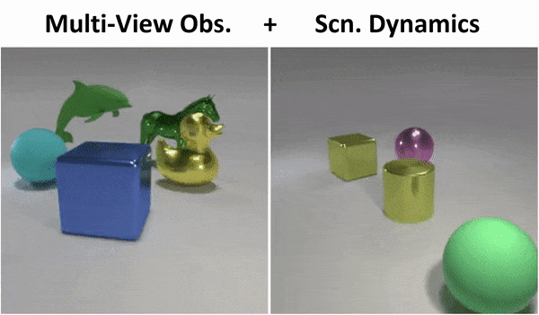

# CLEVR-Object-Centric (CLROC) Data Generators
CLEVR Data Generators for **Object-Centric Representation Learning**.   


<p float="left">
      
    <!--    -->
</p>  


**Highlighted Features:**   (Distinctive from the original [CLEVR](https://github.com/facebookresearch/clevr-dataset-gen) generator)

1. *Multi-view image observation generations* (supported by both `./static_scene_generator` and `./dynamic_scene_generator`)
2. *Multi-view-moving-moving camera observations of dynamic scenes* (with collisions, see `./dynamic_scene_generator`)  


## Acknowledgement  

This repository integrates two image data generators for the [CLEVR](https://github.com/facebookresearch/clevr-dataset-gen) scenes. The two data generators (i.e. `./static_scene_generator` and `./dynamic_scene_generator`) were originally designed for two of our NeurIPS papers [MulMON](https://github.com/NanboLi/MulMON) and [DyMON](https://proceedings.neurips.cc/paper/2021/file/593906af0d138e69f49d251d3e7cbed0-Paper.pdf) respectively. In addition, we give special thanks to Bofeng Fu and Zhixuan Lin (authors of [GSWM](https://sites.google.com/view/gswm)) for providing the initial version of the `./dynamic_scene_generator` generator.   

**Please [CITE](#Cite) these papers if you find the data generators useful.**  
    

## Environment 
(Only supports unix systems.) 

1. Install [Blender 2.79](https://www.blender.org/download/releases/2-79/).  To verify:   

   1.1. Double click the blender executable to ensure the success of the installation

   1.2. Open a terminal and run ```echo $BLENDER```, see if it prints out "`<YOUR-PATH>/blender-2.79b/`". If it does NOT, you could manually add the path to the blender executable file to the `~/.bashrc` file as:  

   ​	```BLENDER=<YOUR-PATH-TO-BLENDER>/blender-2.79b/```    

2. Conda virtual environment:

   2.1. Install [Anaconda](https://docs.anaconda.com/anaconda/install/linux/)

   2.2. Create the "*CLROC*" virtual environment using the provided `./conda_env_CLROC.yml`. Open a terminal, navigate to the root directory of this repo (i.e.`<YOUR-PATH>/CLEVR-Object-Centric`) and then run cmd: 

   ​	```conda env create -f conda_env_CLROC.yml```  

   2.3. Activate "*CLROC*":  

   ​	```conda activate CLROC```

​	All set! *Now you can go to `./static_scene_generator` or `./dynamic_scene_generator` for data generation instructions.*  

   

## Contact  

We constantly respond to the raised ''issues'' in terms of running the code. For further inquiries and discussions (e.g. questions about the paper), email: **nanbo.li@ed.ac.uk**.   
   

## Cite
```latex
@inproceedings{nanbo2020mulmon,
  title={Learning Object-Centric Representations of Multi-Object Scenes from Multiple Views},
  author={Nanbo, Li and Eastwood, Cian and Fisher, Robert B},
  booktitle={Advances in Neural Information Processing Systems},
  year={2020}
}
    
@inproceedings{nanbo2021dymon,
  title={Object-Centric Representation Learning with Generative Spatial-Temporal Factorization},
  author={Nanbo, Li and Raza, Muhammad Ahmed and Wenbin, Hu and Sun, Zhaole and Fisher, Robert},
  booktitle={Advances in Neural Information Processing Systems},
  year={2021}
}
   
@inproceedings{lin2020improving,
  title={Improving generative imagination in object-centric world models},
  author={Lin, Zhixuan and Wu, Yi-Fu and Peri, Skand and Fu, Bofeng and Jiang, Jindong and Ahn, Sungjin},
  booktitle={International Conference on Machine Learning},
  year={2020}
}
```
